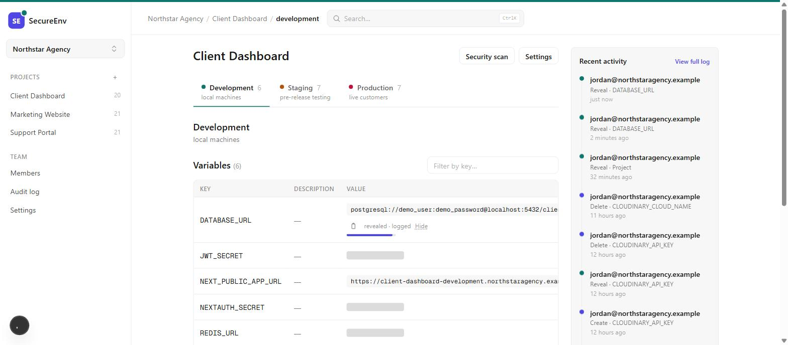
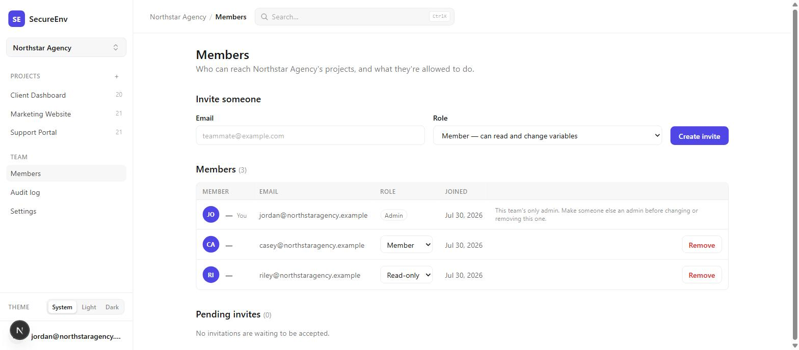
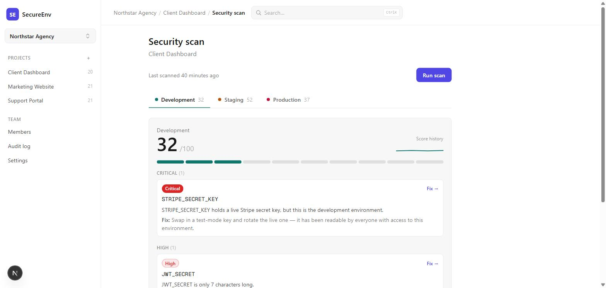
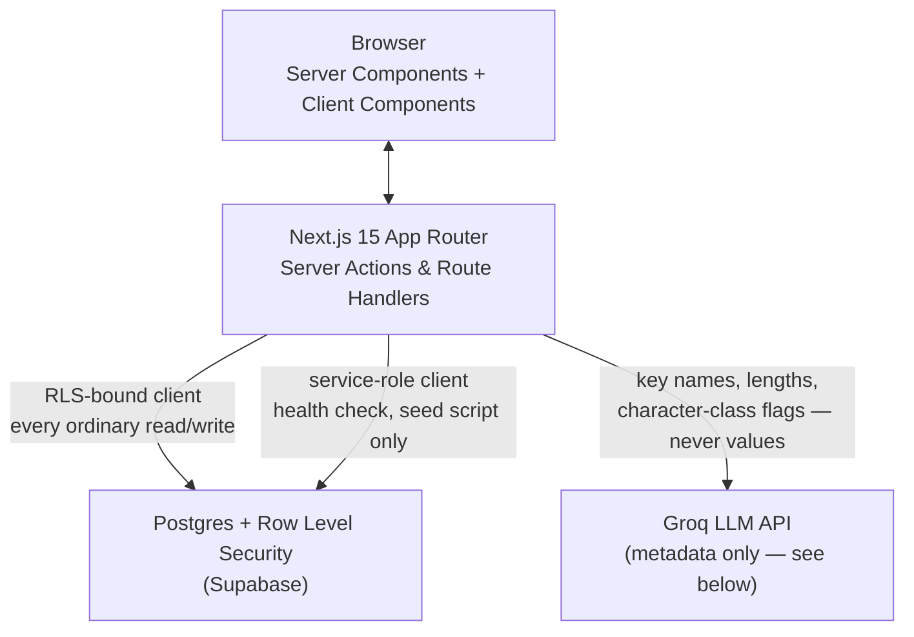
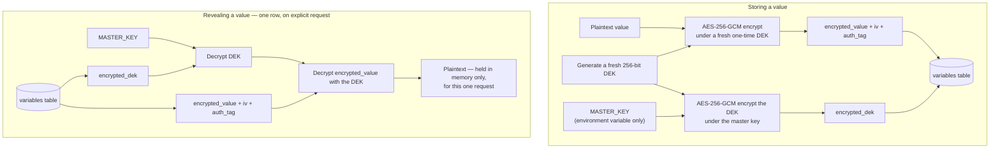
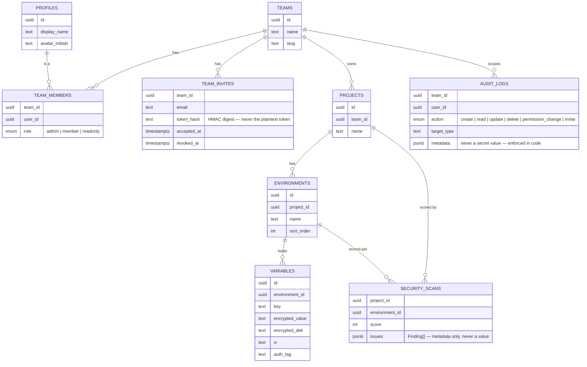

# SecureEnv

**SecureEnv — the redaction ledger for team secrets**

Every dev team ends up with the same problem: API keys and database URLs
pasted into Slack, `.env` files emailed around, and no record of who has
seen what. SecureEnv is a secrets manager for small teams that never stores
a plaintext value, decrypts one value at a time only when someone explicitly
asks, and writes an append-only ledger of every reveal — so "who has seen
this secret" is a query, not a guess.

## Screenshots

**Encrypted storage.** Every value is redacted by default. Revealing one is
an explicit, logged action with a countdown before it re-masks itself.



**Team access control.** Three roles — admin, member, read-only — enforced
by the database itself, not just the UI. The last admin on a team can't be
demoted or removed, so a team can never end up with zero admins.



**AI-assisted security scanning.** Deterministic rules catch what regex can
catch; an LLM layer adds what regex can't — reading only metadata about each
variable, never its value.



## Features

- **Teams, projects, environments, variables** — the hierarchy every real
  deployment already has: a team owns projects, a project has
  development/staging/production environments (plus custom ones), and each
  environment holds key/value variables.
- **Per-variable envelope encryption.** Every secret value is encrypted with
  its own one-time key before it ever reaches the database — see
  [Encryption design](#encryption-design) below.
- **Reveal on demand, never on load.** A variables page renders masked bars
  for every row; decrypting a value is a separate, explicit, audited
  request, and the revealed value re-masks itself after 15 seconds.
- **Three roles, enforced twice.** Admin / member / read-only, checked in
  application code for a readable error message *and* enforced again by
  Postgres Row Level Security, which is the actual boundary — a bypassed or
  buggy server action still can't read or write a row it shouldn't.
- **An append-only audit trail.** Every create, read (reveal), update,
  delete, permission change, and invite is logged with actor, target, and
  sanitized metadata — sanitized because the metadata sanitizer physically
  strips any field name that resembles a secret before the row is ever
  written, not just by convention.
- **Team invites without stored plaintext tokens.** An invite link's token
  is HMAC-hashed before it touches the database; a database-only leak
  yields nothing replayable.
- **A rule-based security scanner.** Seven deterministic checks — short
  secrets, live keys outside production, test keys in production, secret
  names published to the browser, stale values, reused values, and values
  missing from one environment but present in another.
- **An AI layer on top of the rules.** Groq-hosted Llama looks for naming
  and structural problems the rules can't express — and is contractually
  unable to see a decrypted value while doing it (see
  [Encryption design](#encryption-design)).
- **A posture score per environment**, 0–100, weighted by finding severity,
  with a run-on-demand scan, score history, and a "Fix" link that jumps
  straight to the offending variable.
- **An AI-assisted `.env` generator.** Pick the services a project uses;
  the model suggests the standard variable *names* for them — it is
  structurally unable to suggest a value, because the response schema has
  no value field to fill in.
- **A one-click read-only demo.** Anyone can explore the whole app with
  realistic data without signing up — and the account they land on is made
  read-only by the database itself, not by hiding buttons. See
  [Demo mode](#demo-mode).
- **Global search, CSV audit export, dark mode, and a fully keyboard- and
  screen-reader-accessible UI** — the smaller things a "portfolio-quality"
  project can't skip.

## Architecture overview



There is no separate backend service. Every mutation is a Next.js **Server
Action**; every read is a **Server Component** querying Supabase directly.
The one non-obvious architectural decision this forces: **the real
authorization boundary is Postgres RLS, not application code.** Every
server action does check the caller's role first — but only so a denied
attempt gets a readable message ("Only team admins can remove members")
instead of a raw database error. If that check were ever skipped or wrong,
RLS still rejects the write. This split is deliberate enough to have its own
audit: [`docs/permission-audit.md`](docs/permission-audit.md) walks all 22
entry points in the app, the role each one requires, and the two real gaps
that pass found and closed.

RLS policies that need to look at a table *other* than the one they're
gating (e.g., "is this environment's project owned by a team I admin?")
never inline that lookup as a raw subquery — a subquery under RLS runs with
the *caller's* row visibility, which silently re-scopes the check to "what
can this caller already see" instead of "what is actually true." Every
cross-table check goes through a small set of `SECURITY DEFINER` SQL
functions (`is_team_member`, `project_team_id`, `environment_team_id`)
instead. This is the specific bug class the codebase's own migration
history caught and fixed once (a team-bootstrap policy had exactly this
flaw) before generalizing the fix everywhere else.

## Encryption design

A secret value is never encrypted directly under one shared key. Instead,
every value gets its own one-time **data encryption key (DEK)**, and only
*that key* — never the value — is encrypted under a single long-lived
**master key**. This is envelope encryption, and the reason for the extra
layer is entirely about the future: rotating the master key later means
re-wrapping every DEK, a cheap operation on small ~44-byte blobs, instead of
re-encrypting every stored secret value.



The properties this buys, in order of how load-bearing they are:

1. **No plaintext column exists, anywhere.** `variables` has
   `encrypted_value`, `encrypted_dek`, `iv`, and `auth_tag` — all base64
   text. There is no code path in this app that writes an unencrypted
   value to any table.
2. **The master key never touches a secret value directly** — only ever a
   DEK. A key-rotation feature (deliberately deferred; see
   [Roadmap](#roadmap)) can be built later without re-encrypting a single
   stored variable.
3. **AES-256-GCM authenticates as it decrypts.** A tampered ciphertext or a
   wrong master key causes decryption to throw — a generic
   `DecryptionError`, never a partial or "helpfully" corrupted plaintext,
   and never a message that hints at *why* it failed (that distinction is
   exactly what an attacker probing for a tampering oracle would want).
4. **The master key lives only in an environment variable**, never in the
   database. A database-only breach (a leaked backup, a misconfigured
   read replica) yields nothing but unreadable ciphertext. Losing the
   master key makes every stored secret permanently unrecoverable — that's
   the correct trade-off for a key that must never be recoverable *from*
   the data it protects.
5. **Decryption happens one value at a time, on explicit request, never on
   page load.** The variables list a team sees is metadata only (key,
   description, last-updated date); the reveal endpoint decrypts exactly
   one row and nothing else, and that read is written to the audit trail.
   The **one deliberate, narrow exception** is the security scanner: a scan
   compares values against each other (duplicate detection, length checks),
   which cannot be expressed without holding plaintext for every variable
   in a project at once — but that plaintext lives only inside the scan
   function's own call stack. No rule, no AI payload, and no persisted
   `security_scans` row is ever allowed to contain a value; that guarantee
   is enforced in code and asserted by tests, not just documented.
6. **No decrypted value is ever sent to a third party — including the AI
   provider.** The AI security-scanner layer is given key names, value
   *lengths*, coarse character-class flags (has digits / has symbols /
   looks base64 / looks like a URL), environment names, and ages — and
   nothing else. This is checked three separate ways before a request ever
   leaves the process: the payload's fields are a fixed allowlist, every
   string in the payload is asserted to be a key or environment name that
   already exists in the project (so a value can't hide under a renamed or
   invented field), and a pattern sweep catches anything that still looks
   like a live credential shape. Sending a team's own stored secrets to a
   third-party inference API would reproduce the exact vulnerability this
   product exists to prevent — this is the single most important
   guarantee in the codebase after the encryption itself, and it's what the
   test in `lib/scanner/ai.test.ts` is built specifically to catch if it
   ever regresses.

## Data model



Every table lives under Row Level Security. `is_team_member(team_id,
user_id, min_role)` is the one `SECURITY DEFINER` function almost every
policy on almost every table ultimately calls — team roles are declared
`admin, member, readonly` in that order specifically so "at least as
privileged as X" is just an enum comparison (`role <= X`), rather than a
lookup table. Two things RLS can't express drove a second technique,
**column-level GRANT/REVOKE**: `team_invites.token_hash` is unreadable by
any client role at all (only the `accept_team_invite` function, itself
`SECURITY DEFINER`, can read it to validate a token), and
`team_members.role` is the *only* column an ordinary admin's UPDATE may
touch — closing off an admin using the same policy to quietly reassign a
membership row to a different user.

## Local setup

1. **Clone and install.**

   ```bash
   git clone <this-repo>
   cd secureenv
   npm install
   ```

2. **Create a Supabase project** at [supabase.com](https://supabase.com) —
   the free tier is enough for local development.

3. **Apply the database migrations**, in filename order (they're
   timestamped, so a plain sort is correct), from `supabase/migrations/`.
   Either:
   - `npx supabase link --project-ref <your-ref>` then `npx supabase db
     push`, or
   - paste each file's contents into the Supabase Studio SQL editor, one at
     a time, oldest first.

4. **Copy `.env.example` to `.env.local`** and fill in every value — see
   [Environment variables](#environment-variables) below for what each one
   is and how to generate the secrets.

5. **Seed some realistic data (optional, recommended).**

   ```bash
   npm run seed
   ```

   Creates a demo team ("Northstar Agency") with three users at each of the
   three roles, three projects, and dozens of realistic-looking variables —
   including three deliberately planted problems (a live key outside
   production, a too-short secret, a value reused across environments) so
   the security scanner has something real to find on a fresh clone. The
   printed demo login works immediately.

6. **Run it.**

   ```bash
   npm run dev
   ```

   Open [http://localhost:3000](http://localhost:3000).

## Demo mode

The "Explore the demo" button on `/login` signs a visitor straight into a
shared account preloaded with the seeded data — three projects, a populated
audit trail, and a security scan with real findings.

That account's credentials are effectively public, which makes "read-only"
a security property rather than a UI preference. It's enforced with
**restrictive row-level security**: every RLS policy in the rest of this
project is permissive (Postgres ORs them, so a new one can only ever widen
access), but the Phase 43 migration adds one *restrictive* policy per table
per write command, which is ANDed with everything else. A single flag on the
demo account's profile row therefore subtracts write access across every
table at once, without editing a single existing policy — and any permissive
policy added by future work is covered automatically.

Two deliberate exceptions:

- **`SELECT` is untouched.** A demo account that can't read has nothing to
  demo.
- **`audit_logs` stays writable.** Revealing a secret is a read, and a demo
  visitor should be able to do it — but the entire claim of this product is
  that a reveal *gets written down*. Blocking the audit insert would leave
  the demo showing a redaction bar that opens and an activity feed that
  never mentions it, which demonstrates the opposite of the point. The
  existing policy already bounds it: the row must carry the caller's own
  user id and a team they belong to, and there is no UPDATE or DELETE
  policy on that table for anyone.

Server actions also check for a demo session before mutating, but only so
the screen can explain itself — that check lives in `requireTeamAccess()`,
the same preflight every mutating entry point already used, so it applies
everywhere at once including in code written later. It is not the
enforcement; RLS is. `npm run test:demo` proves that distinction by
bypassing the server actions entirely and attempting every write directly
against PostgREST as the demo user.

**Resetting.** The demo is shared, so it needs to go back to a known state.
`npm run demo:reset` does it on demand; `vercel.json` schedules the same
routine daily via `GET /api/demo/reset`, which requires a `CRON_SECRET`
bearer token and refuses every request when that variable is unset. A reset
rewrites variables, clears the demo team's audit rows, and runs a fresh
security scan — but deliberately leaves teams, projects, environments, and
accounts in place, so their ids never change and any URL someone bookmarked
keeps working.

## Environment variables

| Variable | Used for | Exposure |
|---|---|---|
| `NEXT_PUBLIC_SUPABASE_URL` | Base URL of the Supabase project, used by every Supabase client (browser, server, admin) | Public — safe in the browser bundle |
| `NEXT_PUBLIC_SUPABASE_ANON_KEY` | The publishable/anon key. Respects Row Level Security; used for all normal user-facing reads/writes | Public — safe in the browser bundle |
| `SUPABASE_SERVICE_ROLE_KEY` | The secret key. Bypasses Row Level Security; used only by server-only code (the `/api/health` database check, the seed script) | **Secret — server-only.** Never prefix with `NEXT_PUBLIC_`, never import into a Client Component |
| `INVITE_TOKEN_SECRET` | Keys the HMAC that turns a team invite token into the digest stored in `team_invites.token_hash`. The plaintext token is never stored | **Secret — server-only.** Rotating it invalidates every outstanding invite; existing memberships are unaffected |
| `MASTER_KEY` | Encrypts every per-secret data-encryption-key (envelope encryption). The app refuses to start without a well-formed one | **Secret — server-only, never stored in the database.** If it's lost, every stored secret is permanently unrecoverable by design, not a bug |
| `GROQ_API_KEY` | Powers the AI features via Groq's free-tier, OpenAI-compatible REST API — the one third-party credential this project uses. Get one at [console.groq.com/keys](https://console.groq.com/keys) | **Secret — server-only.** No decrypted secret value is ever sent to it — see [Encryption design](#encryption-design) |
| `GROQ_MODEL` | Optional. Overrides the default Groq model without a code change | Not secret, but has no reason to be public either |
| `DEMO_USER_EMAIL` / `DEMO_USER_PASSWORD` | Optional. The account behind the one-click demo button; both default to the account `npm run seed` creates. Set `DEMO_USER_PASSWORD` to an empty string to remove the demo button entirely | Public by design — the credentials are handed to anyone who clicks. What makes that safe is the RLS lockdown in [Demo mode](#demo-mode), not secrecy |
| `CRON_SECRET` | Required for the scheduled demo reset (`/api/demo/reset`, scheduled in `vercel.json`). Vercel sends it as a bearer token on cron invocations once set on the project | **Secret — server-only.** That route runs with the service role and bypasses every RLS policy including the demo lockdown; it refuses every request while this is unset rather than defaulting to open |

Generate the two random secrets with:

```bash
node -e "console.log(require('crypto').randomBytes(32).toString('base64url'))"  # INVITE_TOKEN_SECRET
node -e "console.log(require('crypto').randomBytes(32).toString('hex'))"        # MASTER_KEY
```

Double-check the anon and service-role keys are copied from the **same**
Supabase project as the URL — Supabase returns a generic `Invalid API key`
error if a key from a different project is pasted in.

## Deployment

1. Push this repo to GitHub (or GitLab/Bitbucket).
2. In the [Vercel dashboard](https://vercel.com/new), import the
   repository. The Next.js framework preset is auto-detected — leave
   build/output settings at their defaults.
3. Under **Environment Variables**, add every variable from the table
   above, for Production, Preview, and Development.
4. Click **Deploy**. Vercel runs `npm run build`, which also runs
   `next lint` and the TypeScript check — the build fails if either has
   errors.
5. Once deployed, confirm the database connection is live by visiting
   `https://<your-deployment>.vercel.app/api/health`. A healthy deploy
   returns HTTP 200 with `{"status":"ok", ...}`; if Supabase is
   unreachable or a key is wrong, it returns HTTP 503 with
   `{"status":"degraded", ...}` and an error message — never a secret
   value.
6. Every subsequent push to the connected branch redeploys automatically.

## Testing

Two layers, for two different guarantees.

**Unit tests** (`npm test`, Vitest) — pure logic, no network, no database.
This is where the project's two most important tests live:

- `lib/crypto/envelope.test.ts` — encrypt/decrypt round-trips, tamper
  detection (a flipped bit in the ciphertext or auth tag must fail to
  decrypt, never silently return corrupted plaintext), and that two
  encryptions of the same value never produce the same ciphertext (a fresh
  DEK and IV every time).
- `lib/scanner/ai.test.ts` — the payload-boundary tests described in
  [Encryption design](#encryption-design). These are written to fail if
  someone later adds a `value` field to the AI payload, renames a field to
  smuggle one in, or hides one inside an otherwise-allowed string — not
  just to pass today.

Also covered: the audit-metadata secret-field sanitizer, the seven
rule-based scanner checks (with an explicit assertion that no finding ever
contains a decrypted value), the AI response normalizer (dedup against the
deterministic rules, severity/category validation), and the AI `.env`
generator's schema (proving a model-supplied value is structurally
impossible to keep).

**Live smoke scripts** (`scripts/test-*.ts`, run via `tsx` against a real
Supabase project — never mocked) — the checks that only mean something
against a live database with real RLS policies applied:

| Script | What it proves |
|---|---|
| `npm run test:rls` | Cross-team reads/writes are actually rejected by policy, not just by application code |
| `npm run test:invites` | The full invite lifecycle: create → redeem by a brand-new account → replay/expiry/revocation/email-mismatch all correctly rejected |
| `npm run test:members` | Role changes, removal, and the last-admin protection trigger |
| `npm run test:profiles` | Column-level grants — a user can update their display name but not their own `created_at` |
| `npm run test:projects` / `test:environments` / `test:variables` | CRUD and role thresholds for each layer of the hierarchy |
| `npm run test:ai` / `test:generator` | Real calls to the Groq API — the secret-guard blocks a secret-shaped prompt before any request is sent; a real response round-trips through schema validation |
| `npm run test:scanner` | The rule-based scanner against real decrypted rows in a seeded project, including the three deliberately planted problems |
| `npm run test:scanner:ai` | The full scan pipeline end to end — real ciphertext decrypted, real Groq call, real `security_scans` row persisted, with the same "no value anywhere" assertion re-checked against production data instead of a fixture |
| `npm run test:demo` | That the public demo account genuinely cannot write — every write attempted directly against PostgREST, bypassing the server actions, with each denial confirmed by a service-role re-read rather than by waiting for an error RLS doesn't raise |

## Roadmap

Deliberately deferred, not overlooked:

- **A CLI tool.** `secureenv pull`/`push` for syncing a project's variables
  to and from a local `.env` file would make this feel like a tool
  developers reach for daily instead of a web app they visit occasionally
  — a good standalone next project once the web app is stable.
- **KMS-backed, per-tenant keys.** Today there is one master key for the
  whole deployment. A multi-tenant SaaS version would give each team (or
  each customer, for an on-prem/BYOK offering) its own key, held in a real
  KMS (AWS KMS, GCP Cloud KMS) rather than a plain environment variable —
  removing the "one leaked env var compromises every team" blast radius.
- **Master-key rotation.** The envelope-encryption design
  ([above](#encryption-design)) exists specifically so this is cheap when
  it's built: re-wrap every `encrypted_dek` under a new master key without
  touching a single `encrypted_value`.
- **Secret version history.** Right now an edit overwrites a variable's
  value with no way to see or restore a prior one. Versioning needs its
  own retention and access-control story (an old value is still a value)
  before it's worth building.
- **Subscription tiers.** Team size limits, seat-based billing, and an
  upgrade flow — deferred because they're a product decision, not an
  engineering one, and premature before there's a second real customer to
  learn from.
- **Further AI features.** The scanner and the `.env` generator are built;
  a natural next step is a scan that runs automatically on every deploy (a
  CI/CD integration posting findings as a PR comment) or a Slack alert the
  moment a critical finding is detected, rather than only on-demand from
  the dashboard.
